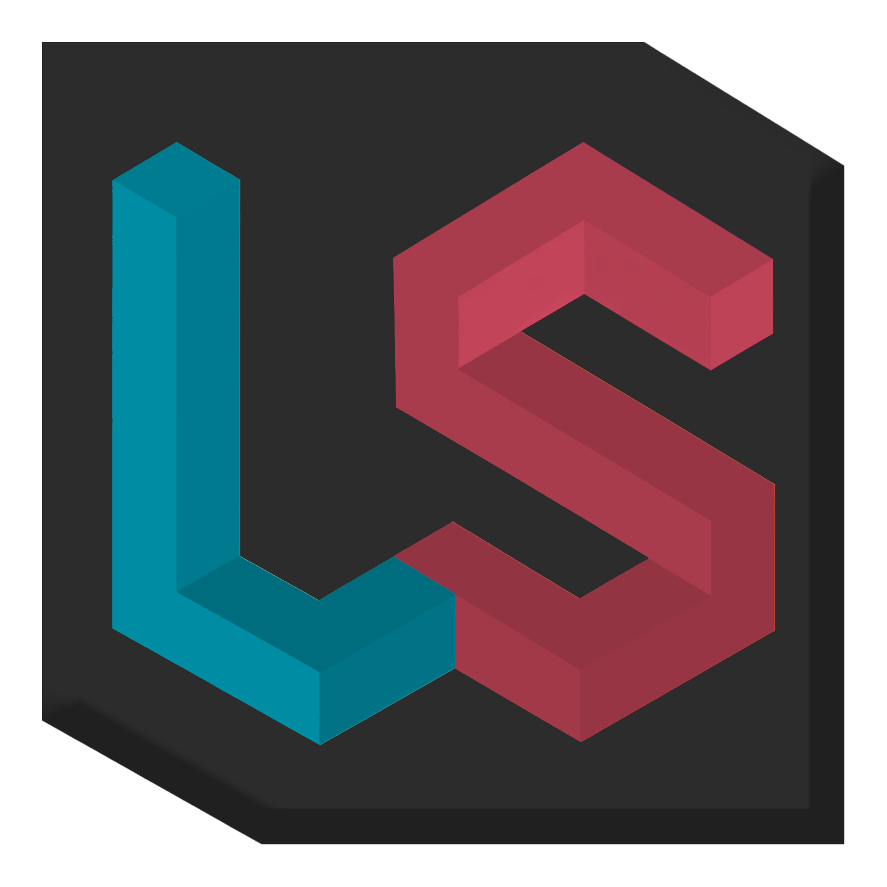
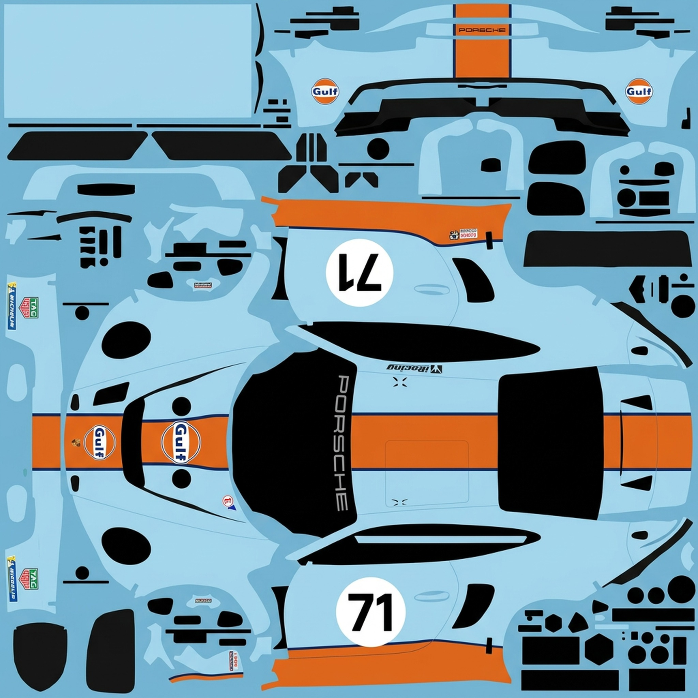
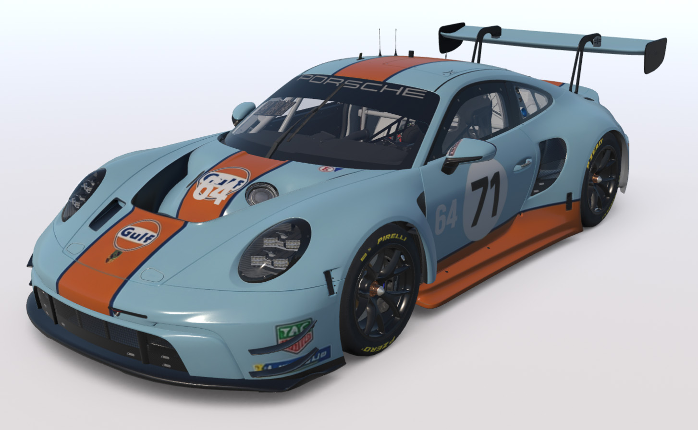
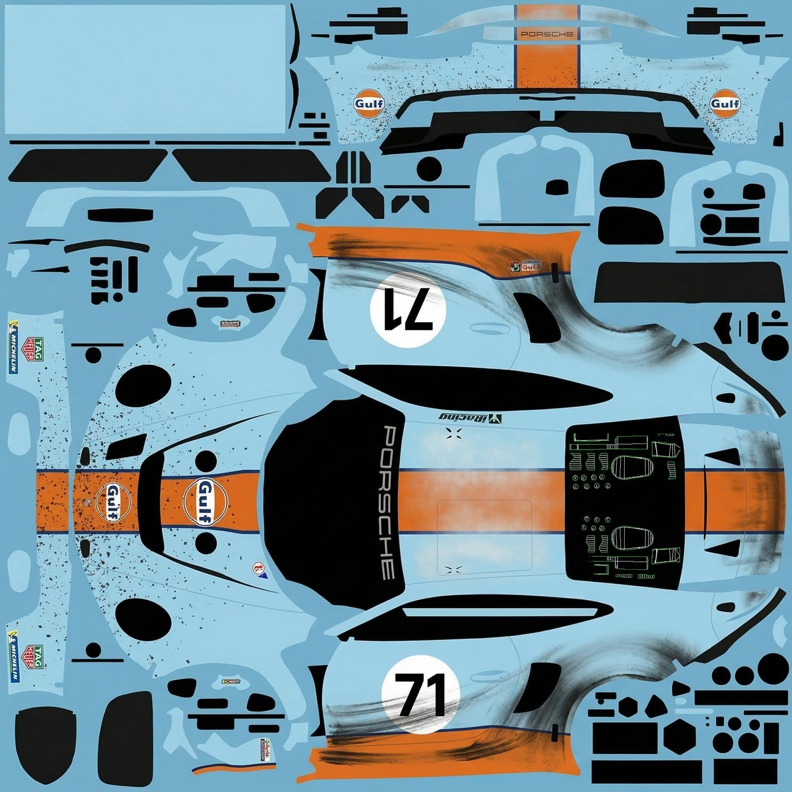
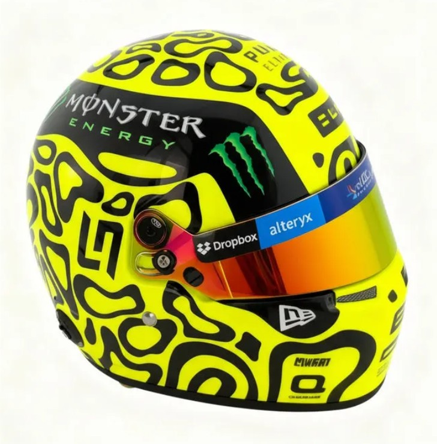
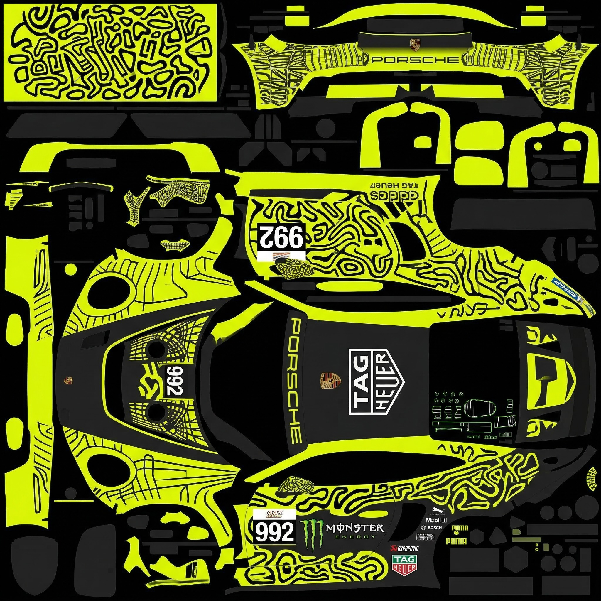
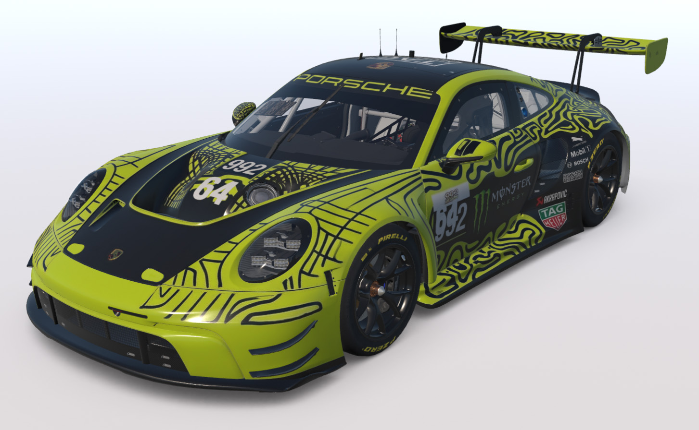

# Livery AI Studio



A Windows desktop app that generates custom iRacing car liveries using Google Gemini AI — describe your design in plain English, get somewhat usable livery texture, and have it auto-deployed to iRacing in seconds.

   [](https://www.gnu.org/licenses/agpl-3.0) [](https://github.com/jamesdhooks/livery-ai-studio/actions/workflows/test.yml)

> **⚠️ AI output is a starting point.** Results can be low quality, misaligned, or lack fine detail. Treat the output as a rough draft and refine it in [Photoshop](https://www.adobe.com/products/photoshop.html), [GIMP](https://www.gimp.org/) (free), or [Photopea](https://www.photopea.com/) (free) before publishing.

Created by the iRacing community [Blue Flags & Dads](https://blueflagsanddads.com) — [join our Discord](https://discord.gg/fFqBerZ9rR) and share your creations in **#paintshop**!

*Fan-made tool, not affiliated with iRacing.com or TradingPaints.com. All trademarks belong to their respective owners.*

---

## How It Works

```
Your prompt  +  UV wireframe  (+  optional base texture)
        ↓
Google Gemini  (Image Generation API)
        ↓
2048×2048 livery texture  →  converted to .tga
        ↓
Auto-deployed to  Documents\iRacing\paint\<car>\
```

The app runs as a native desktop window (Flask + pywebview). Fill in the form, click **Generate**, and your livery appears in-game.

---

## Examples

### Generate — Gulf Racing Heritage

> *"Gulf Racing heritage livery — pale powder blue base with broad burnt orange stripe across the hood and flanks, white roundels, period-correct Gulf logo placement, thin pinstripe border between colours"*

| Texture | iRacing |
|:-------:|:-------:|
|  |  |

### Modify — Race-Worn Weathering

> *"Add realistic race-worn weathering throughout — stone chips across the nose and leading edges, brake dust staining around the rear wheel arches, tyre rubber deposits along the lower sills, faded paint on the roof from prolonged sun exposure"*

| Texture | iRacing |
|:-------:|:-------:|
|  |  |

### Reference Image — Color & Pattern Extraction

> *"Match the patterns from this helmet to the livery — same colors and shapes applied across the car body in a logical way"*

| Reference | Texture | iRacing |
|:---------:|:-------:|:-------:|
|  |  |  |

---

## Features

- **AI Livery Generation** — describe your design in plain English, get a workable livery texture
- **Auto Preview** — auto-copies the TGA to iRacing for instant in-game preview
- **History Browser** — browse, reload, iterate on, and upscale past liveries
- **GPU Upscaling** *(optional)* — Real-ESRGAN 4× upscale for crisp 2048×2048 textures

---

## Requirements

| Requirement | Details |
|-------------|---------|
| **OS** | Windows 10/11. Linux/macOS can run the app but cannot deploy to iRacing. |
| **Python** | 3.10 or newer |
| **API Key** | Google Gemini API key with billing enabled — [aistudio.google.com](https://aistudio.google.com) |
| **iRacing** | Installed with at least one car |
| **Trading Paints** | Installed from [tradingpaints.com/install](https://www.tradingpaints.com/install) for livery loading |
| **GPU Upscaling** *(optional)* | NVIDIA GPU (6+ GB VRAM) — install with `start.bat --gpu` |

> Without an NVIDIA GPU, upscaling is disabled in the UI. Generated textures are still resized to 2048×2048 via Lanczos resampling — works fine, just less sharp than Real-ESRGAN.

---

## Quick Start

### 1. Clone and launch

```bash
git clone https://github.com/jamesdhooks/livery-ai-studio.git
cd livery-ai-studio
```

Double-click one of these to start:

| Script | Description |
|--------|-------------|
| `start.bat` | First-time setup + launch |
| `start-quick.bat` | Skip install checks, launch immediately |
| `start-with-upscale.bat` | Install & launch with GPU upscaling (NVIDIA required) |
| `user-start.bat` | Customizable template — edit to set your own default flags |

On first run, the script creates a `.venv`, installs all Python dependencies, and launches the app.

### 2. Configure your API key

Click **⚙️ Settings** → paste your Gemini API key → **Save Settings**.

Your key is stored locally in `config.json` — never committed to Git.

### 3. Set your iRacing Customer ID

In **Settings**, enter your **iRacing Customer ID** (found at [members.iracing.com](https://members.iracing.com), top right).

### 4. Install Trading Paints

[Download and install Trading Paints](https://www.tradingpaints.com/install), sign in with your iRacing account. It automatically syncs your paint folder.

### 5. Generate your first livery

Pick a car from the topbar → **🎨 Generate** tab → type a description → **Generate Livery** → wait 15–30 seconds.

Your livery is auto-deployed. In iRacing, find your car under "My Content" → "Car Model".

### 6. Share online *(optional)*

Download the PNG from the livery preview, then upload it at [tradingpaints.com/upload](https://www.tradingpaints.com/upload).

---

## Recommended Workflow

AI results vary — plan to spend time refining the output, especially around panel seams, logos, and text.

1. **Pick your car from the dropdown** download the official template either from the link in the application or from [tradingpaints.com/cartemplates](https://www.tradingpaints.com/cartemplates).
2. **Go to the generate tab** write your prompt and generate a livery, preview it in iRacing.
r. **Make tweaks** using the "Modify" function in the generate tab, make targeted changes "Move the logo from the roof to the hood", "Change the red highlights to blue".
3. **Download or copy the livery** use the in-application buttons to copy or download the liveery, then load it into your favourite editor and make refinements until you are happy.
   - [Adobe Photoshop](https://www.adobe.com/products/photoshop.html) · [GIMP](https://www.gimp.org) (free) · [Photopea](https://www.photopea.com/) (free, browser) · [Affinity Photo](https://affinity.serif.com/en-us/photo/) (one-time purchase)
4. **Export and upload** the finished TGA to [Trading Paints](https://www.tradingpaints.com/upload).

---

## Start Script Options

| Flag | Description |
|------|-------------|
| `--gpu` | Install GPU upscaling (NVIDIA required, CUDA 12 default) |
| `--gpu --cuda 11` | CUDA 11.8 for RTX 30xx |
| `--gpu --cuda 12` | CUDA 12.4 for RTX 40xx / 50xx |
| `--gpu --cuda 50` | CUDA 12.8 nightly for RTX 50xx / Blackwell |
| `--port 8080` | Use a custom port (default: 5199) |
| `--skip-install` | Skip `pip install` for faster restart |
| `--build-frontend` | Rebuild the React UI (requires Node.js) |
| `--web-only` | Launch in browser only (skip native pywebview window) |
| `--auto-load` | **Dev mode:** HMR + hot reload (implies `--web-only`, requires Node.js) |

**GPU setup:** `start.bat --gpu` installs PyTorch + Real-ESRGAN, downloads model weights (~67 MB), and patches a known torchvision compatibility issue automatically.

**Frontend development:** `start.bat --auto-load` starts the Vite dev server with hot module reload. The Flask backend and frontend dev server run simultaneously on ports 5000 and 5173 respectively. Edit frontend files and see changes instantly without rebuilding.

**Examples:**
- `start.bat --gpu --build-frontend` — Install GPU + rebuild frontend
- `start.bat --web-only --port 8080` — Browser-only mode on custom port
- `start.bat --skip-install --web-only` — Quick restart in browser mode
- `start.bat --auto-load` — Dev server with HMR for frontend development

Run `python setup.py --check` to verify your upscale setup.

---

## Models & Costs

> ⚠️ **Prices may be out of date.** Always verify at [ai.google.dev/gemini-api/docs/pricing](https://ai.google.dev/gemini-api/docs/pricing). You can override values in **⚙️ Settings → API Pricing**.

> 💳 **All Gemini API charges are billed directly to your Google account** — including failed or poor-quality generations. Set a [budget alert](https://cloud.google.com/billing/docs/how-to/budgets) to avoid surprises.

| Mode | Resolution | Cost per image |
|------|-----------|---------------|
| **Flash 1K** | 1024 px | ~$0.067 |
| **Flash 2K** | 2048 px | ~$0.101 |
| **Pro** | 2048 px | ~$0.134 |

**Best value:** Flash 1K + GPU Upscale — generates at 1K (~$0.067), then Real-ESRGAN 4× upscales to 2048×2048 on your GPU. Same final resolution as 2K at ~33% less cost.

---

## Building the EXE

The default build excludes PyTorch/Real-ESRGAN so it runs on any Windows machine.

```bash
build_exe.bat              # Build exe + rebuild React frontend
build_exe.bat --no-frontend  # Skip frontend rebuild (faster)
```

Output: `dist\Livery-AI-Studio-v<VERSION>\` — zip this folder for distribution.

**GPU build:** Install GPU deps into the build venv first (`pip install torch torchvision realesrgan basicsr`), add them to `hiddenimports` in `livery_ai_studio.spec`, then re-run. GPU builds are ~2 GB+ due to PyTorch/CUDA.

See `RELEASE_GUIDE.md` for the full publishing checklist.

---

## Project Structure

```
livery-ai-studio/
├── app.py                  # Desktop app entry point (Flask + pywebview)
├── server/                 # Flask routes, config, business logic
├── frontend/               # React + Vite source (edit this)
│   └── src/
│       ├── components/     # UI components (common/, layout/, tabs/, modals/)
│       ├── hooks/          # Custom React hooks
│       ├── services/       # API service layer
│       └── test/           # Vitest + React Testing Library
├── static/                 # Built React app (served by Flask — do not edit)
├── car_library/            # Pre-extracted car templates (read-only)
├── config.json             # Local settings (auto-created, git-ignored)
└── start.bat / start.sh    # Launch scripts
```

---

## Key Paths

| What | Path |
|------|------|
| iRacing paint folder | `%USERPROFILE%\Documents\iRacing\paint\<car>\` |
| App config | `config.json` (next to exe / repo root) |
| Data folder | `data\` (next to exe / repo root, configurable in Settings) |
| Paint filename | `car_<customerID>.tga` |

---

## Troubleshooting

| Problem | Solution |
|---------|----------|
| App won't start | Use `start.bat`, not `python app.py`. Check terminal output for errors. |
| API key error | Check Settings. Ensure billing is enabled at [console.cloud.google.com](https://console.cloud.google.com) → Billing. |
| No image returned | Gemini may be at capacity — wait and retry, or switch models. |
| Upscale tab shows warning | Run `start.bat --gpu`. Requires NVIDIA GPU. |
| Poor quality | Use a more detailed prompt, a clean wireframe, and the Pro model. |
| Result doesn't match the wireframe / panels look wrong | The AI has a mind of its own — results are not guaranteed. Try simplifying your prompt (fewer elements, plainer colours), regenerate a few times, or use Modify mode to nudge a promising result. Panel alignment is inherently approximate because Gemini is generating a 2D texture without true 3D awareness. |

---

## Security & Privacy

- API key stored locally in `config.json` (git-ignored, never leaves your machine)
- All processing runs locally except Gemini API calls

---

## Support the Project

[](https://buymeacoffee.com/jamesdhooks)

---

## Disclaimer & Responsible Use

This project is provided **as-is** for personal use. By using it you agree:

- **No output warranty** — AI results are unpredictable. The maintainers make no guarantees on quality, accuracy, or fitness for purpose. Always review output before publishing.
- **API costs are yours** — all Gemini charges are billed to your Google account, including failed requests. The maintainers accept no financial responsibility.
- **Content responsibility** — do not submit prompts requesting reproduction of copyrighted logos or team liveries. You are responsible for compliance with iRacing and Trading Paints rules.
- **The maintainers are not liable for how you use this tool or its outputs.**

---

## Contributing & Roadmap

See [CONTRIBUTING.md](CONTRIBUTING.md) for setup and guidelines. Check [ROADMAP.md](ROADMAP.md) for planned features. Issues tagged [`good first issue`](https://github.com/jamesdhooks/livery-ai-studio/issues?q=is%3Aissue+is%3Aopen+label%3A%22good+first+issue%22) or [`help wanted`](https://github.com/jamesdhooks/livery-ai-studio/issues?q=is%3Aissue+is%3Aopen+label%3A%22help+wanted%22) are great places to start.

---

## License

Licensed under **AGPL-3.0**. See [LICENSE](./LICENSE) for full text.

- BYOK model — you supply your own Gemini API key and are billed directly by Google.
- Hosted-service obligations: [TERMS.md](./TERMS.md)
- Trademark restrictions: [TRADEMARK.md](./TRADEMARK.md)